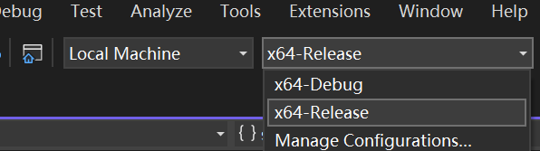

# Solar Irradiance Simulation Tool

## Environment setup

### Create virtual python environment

```
conda create --name energy python=3.9
```


```
conda activate energy
```


install packages

```
pip install pvlib pandas numpy tqdm matplotlib cjio
```


### Compile the program

- Install Visual Studio community version with `Desktop development with C++`

- install Nvidia Optix API [NVIDIA OptiX™ Downloads | NVIDIA Developer](https://developer.nvidia.com/designworks/optix/download)

- Open the project folder with Visual Studio

- Set configuration to `x64-Release`

  

- Run Build All

  


## Data preprocessing

```shell
cd pythonscript
pythonscript>python process_weatherstation.py Delft_tiles.json processed_delft.city.json
```


copy and paste the processed cityjson file to the folder ```data/{cityname}/citymodel```


## Config the running

```
{
    "area_per_point": 9,
    "azimuth_resolution": 5,
    "elevation_resolution": 5,
    "epw_file": "rotterdam.epw",
    "irradiance_batch_size": 500,
    "irradiance_model": "isotropic",
    "num_bounces": 1,
    "output_folder_name": "output_20241113_190423",
    "scenario": "weatherstation",
    "study_area": {
        "data_root": "./data/Delft",
        "end_time": "2021-02-02 00:00:00",
        "frequency": "10min",
        "lat": 52.01,
        "long": 4.37,
        "start_time": "2021-02-01 00:00:00",
        "timezone": "Europe/Amsterdam"
    },
    "voxel_resolution": 9
}
```


- `area_per_point`: the coverage area for each sample point. (The sampling density)
- `azimuth_resolution` and `elevation_resolution`: angular resolution for hemispheric sampling
- `epw_file`: the epw filename. File location should be: `data/{Cityname}/city.epw`
- `irradiance_batch_size`: for current implementation 500, 1000, 1500 does not show clear difference, larger batch size will require higher memory
- `irradiance_model`: only isotropic is supported in current implementation
- `num_bounces`: the number of bounces to be simulated for reflective solar irradiance. For current implementation 2 is enough. Values could be 0, 1, 2, ...
- `scenario`: for different source of cityjson data. For cityjson file generated with the same pipeline of Heino weather station or the whole cities. Use "weatherstation"

- `study_area`: configuration of the study area
  - frequency:  Default is 10minutes. Other available frequency: [Time series / date functionality — pandas 2.2.0 documentation (pydata.org)](https://pandas.pydata.org/docs/user_guide/timeseries.html#timeseries-offset-aliases)
- `voxel_resolution`: the voxel size used for reflective solar irradiance computation


## Run simulation

```
run_simulations.bat
```


## Interpretation of result

`data/{cityname}/output_20241113_190423/intermediate/point_grid.dat`

```
x y z nx ny nz albedo surface_type surface_id(global_idx generated in the preprocessing step)
```


`data/{cityname}/output_20241113_190423/irradiance.npy`

```
array with shape (M, N, T)
```

- M is the number of bounces. The array will record irradiance values for different number of bounces
- N is the number of sample points
- T is the number of computation timesteps/epochs


`data/{cityname}/output_20241113_190423/simplified_irradiance.npy`

```
array with shape (3, N, T)
```

- array[0]: direct beam solar irradiance
- array[1]: simplified diffuse irradiance value: (only use a simple SVF for computation)
- array[2]: simplified reflective irradiance value: (only use a simple GVF for computation)


`data/{cityname}/output_20241113_190423/intermediate/config.json`

new values added to the config to record computation result:

```
    "result": {
        "bbox_max": [
            88515.0,
            451015.0,
            95.04199981689453
        ],
        "bbox_min": [
            81835.0,
            444326.125,
            -24.412002563476562
        ],
        "num_timesteps": 54,
        "shadow_calculation_time": 1.5724155902862549,
        "viewshed_rendering_time": 301.1038818359375,
        "voxel_dim_x": 743,
        "voxel_dim_y": 744,
        "voxel_dim_z": 14,
        "direct_diffuse_time": 16.214728355407715,
        "global_irradiance_time": 39891.2765686512
    },
```

Time in seconds.


### Visualization of the result

check `pythonscript/point_cloud_visualize.ipynb` for details


# Current settings for fixed hyperparams

```
surface_type_map["WallSurface"] = 0;
surface_type_map["RoofSurface"] = 1;
surface_type_map["GroundSurface"] = 2;
surface_type_map["TIN"] = 3;
surface_type_map["Tree"] = 4;
surface_type_map["Window"] = 5;
```


```
surface_albedo_map = {{"WallSurface", 0.4}, 
                      {"RoofSurface", 0.1}, 
                      {"GroundSurface", 0.2}, 
                      {"TIN", 0.05}, 
                      {"Tree", 0.3}, 
                      {"Window", 0.3}}
```

